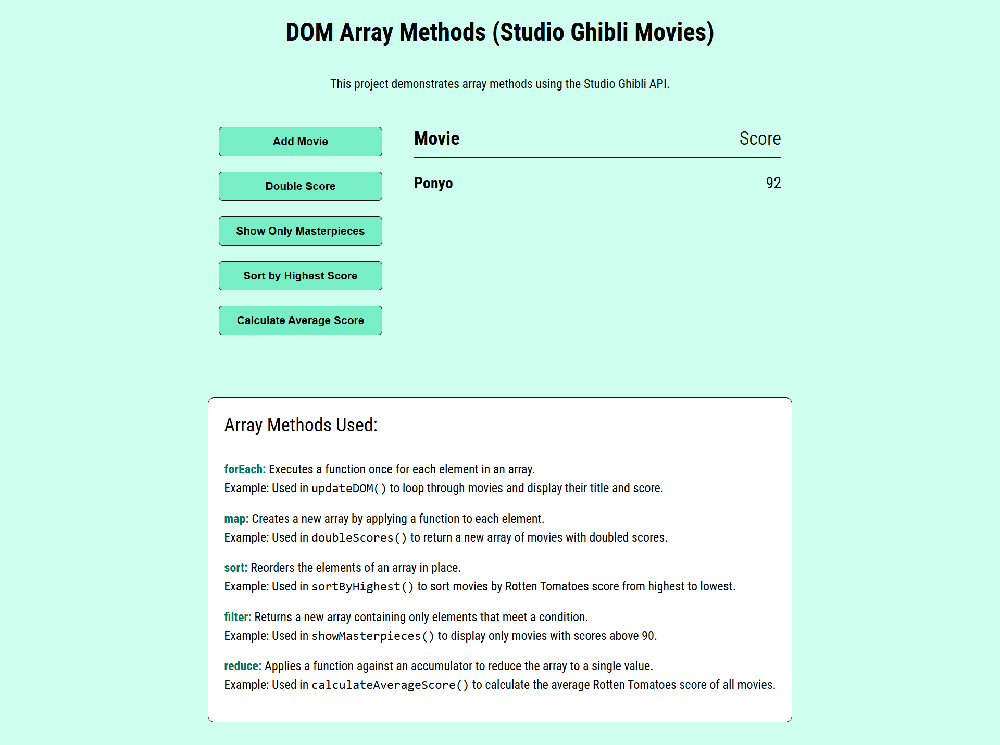

# 🎬 Studio Ghibli Array Methods Project

This project demonstrates the use of **JavaScript array methods** (`forEach`, `map`, `sort`, `filter`, and `reduce`) by fetching movie data from the **Studio Ghibli API** and manipulating it in different ways.


## 🚀 Features
- Fetches Studio Ghibli movies using the [Studio Ghibli API](https://ghibliapi.vercel.app/).
- Allows you to:
  - **Add Movie** → Fetch and display a random Ghibli movie with its Rotten Tomatoes score.  
  - **Double Score** → Doubles the score of all movies using `map`.  
  - **Show Only Masterpieces** → Filters movies with a score above 90 using `filter`.  
  - **Sort by Highest Score** → Sorts movies in descending order by score using `sort`.  
  - **Calculate Average Score** → Uses `reduce` to calculate and display the average Rotten Tomatoes score.  


## 🛠️ Array Methods Explained
This project uses the following JavaScript array methods:

### forEach()
Executes a function for each array element.  
**Example:** Displaying each movie and its score in the DOM. 
```
function updateDOM(providedData = data) {

  main.innerHTML = '<h2><strong>Movie</strong> Score</h2>';

  providedData.forEach(item => {
    const element = document.createElement('div');
    element.classList.add('person');
    element.innerHTML = `<strong>${item.title}</strong> ${formatNumber(item.score)}`;
    main.appendChild(element);
  });
}
```

### map()
Creates a new array by applying a function to each element.
**Example:** Doubling all Rotten Tomatoes scores.
```
function doubleScores() {
  data = data.map(movie => {
    return { ...movie, score: movie.score * 2 };
  });

  updateDOM();
}
```

### sort()
Sort array elements in place.
**Example:** Sorting movies from highest to lowest score.
```
function sortByHighest() {
  data.sort((a, b) => b.score - a.score);

  updateDOM();
}
```

### filter()
Returns a new array containing elements that pass a condition.
**Example:** Filtering movies with scores above 90 (masterpieces).
```
function showMasterpieces() {
  data = data.filter(movie => movie.score > 90);

  updateDOM();
}
```

### reduce()
**Example:** Calculating the average Rotten Tomatoes score.
```
function calculateAverageScore() {
  if (data.length === 0) return;

  const total = data.reduce((acc, movie) => acc + movie.score, 0);
  const avg = total / data.length;

  const avgElement = document.createElement('div');
  avgElement.innerHTML = `<h3>Average Score: <strong>${avg.toFixed(1)}</strong></h3>`;
  main.appendChild(avgElement);
}
```

## How to run
1. Clone this repository: ```git clone https://github.com/dianabali/dom-array-methods-studio-ghilbi-api.git```
2. Run ```index.html``` in your browser.

## Preview


